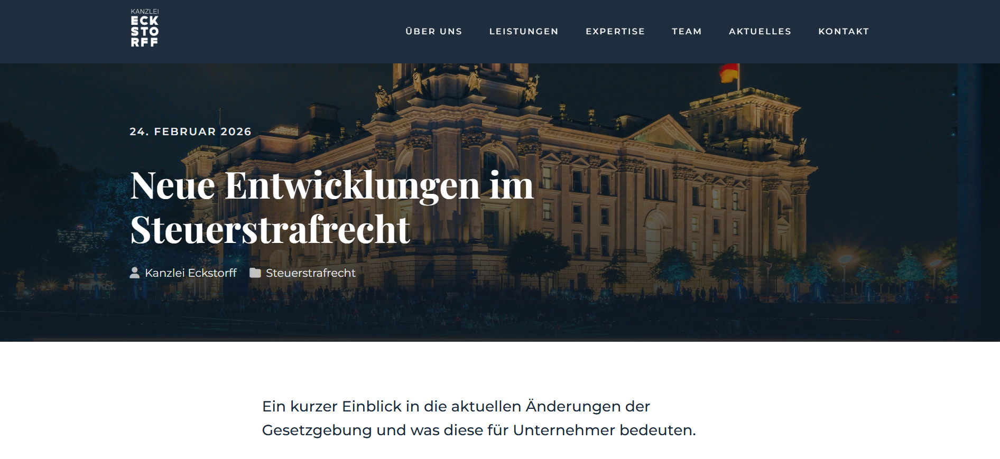

# Kanzlei Eckstorff - Landing Page



## Overview
A modern, premium landing page for **Kanzlei Eckstorff**, a specialized law firm based in Berlin. The project focus is on criminal law defense (Strafverteidigung) with a particular emphasis on tax criminal law (Steuerstrafrecht).

## Features
- **Responsive Design**: Optimized for desktops, tablets, and mobile devices.
- **Dynamic UI**: Smooth scroll-triggered animations and interactive elements.
- **Service Grid**: Clear presentation of legal expertise areas.
- **Interactive Map**: Custom Leaflet integration with a pulsing marker and automatic address popup.
- **Blog Section**: Linked post templates for demonstrating content delivery.
- **Back to Top**: Intuitive navigation with a dedicated scroll button.

## Tech Stack
- **Structure**: HTML5 Semantic Markup
- **Styling**: SCSS (Sass) for modular and maintainable CSS
- **Interactivity**: Vanilla JavaScript (ES6+)
- **Map**: Leaflet.js with OpenStreetMap
- **Icons**: FontAwesome 6
- **Fonts**: Google Fonts (Montserrat & Playfair Display)

## Getting Started

### Prerequisites
- Node.js and npm installed.

### Installation
1. Clone the repository:
   ```bash
   git clone [repository-url]
   ```
2. Install dependencies:
   ```bash
   npm install
   ```

### Development
To start the development server with live reloading and SCSS compilation:
```bash
npm start
```
This runs `browser-sync` and `sass --watch` concurrently.

## Contact & Location
**Kanzlei Eckstorff**  
Kurfürstendamm 66  
10707 Berlin  
Germany

---
*Created with focus on premium aesthetics and user experience.*
